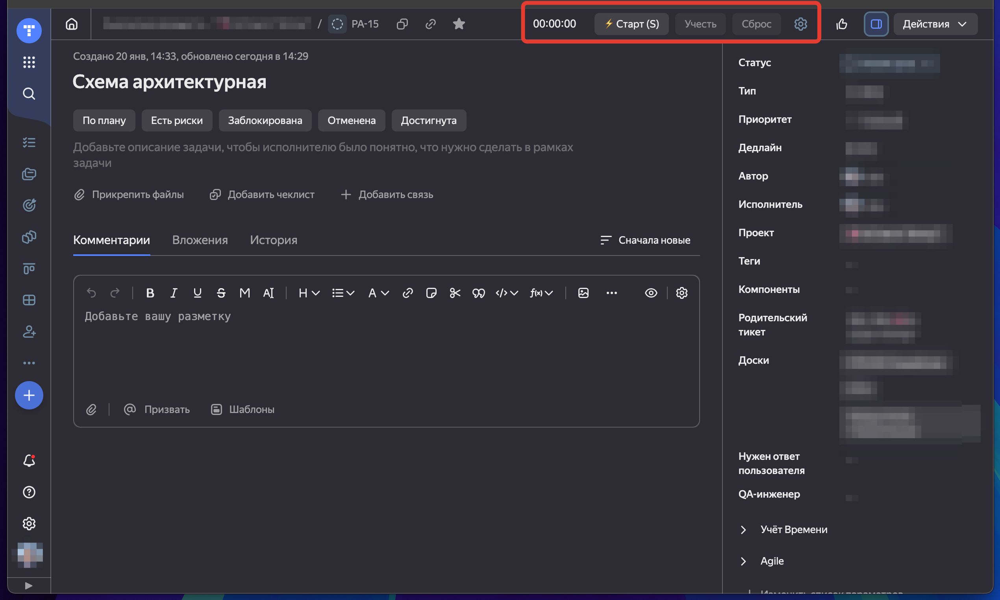
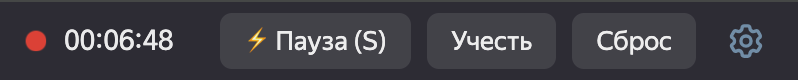
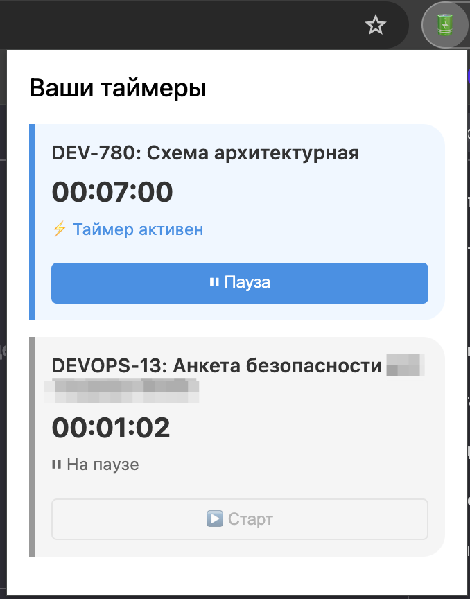

# Chrome Tracker Timer Extension

Расширение для Chrome, добавляющее таймер для учета времени в Yandex.Tracker.

## Основные возможности

- ⏱ Отслеживание времени работы над задачами
- ⌨️ Горячая клавиша для старта/паузы таймера (S/Ы)
- 🔄 Синхронизация таймеров между вкладками
- ⚠️ Предупреждение при закрытии вкладки с активным таймером
- 📝 Автоматическое заполнение формы учета времени
- 🎨 Поддержка светлой и темной тем
- 🔔 Визуальные индикаторы активного таймера:
  - Мигающая точка рядом с таймером
  - Иконка в меню браузера
  - Молния и название задачи в заголовке вкладки
- 🖥️ Удобный popup-интерфейс для управления таймерами

## Горячие клавиши

- `S` / `Ы` - Старт/Пауза таймера

## Установка

1. Скачайте последнюю версию расширения
2. Откройте Chrome и перейдите в меню расширений:
   - Через три точки в правом верхнем углу → "Дополнительные инструменты" → "Расширения"
   - Или введите в адресной строке: `chrome://extensions/`
3. Включите "Режим разработчика" (переключатель справа вверху)
4. Нажмите "Загрузить распакованное расширение"
5. Выберите папку с расширением

После установки таймер появится на странице задачи в Yandex.Tracker.